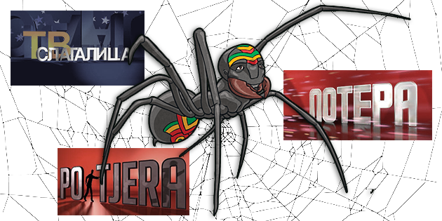
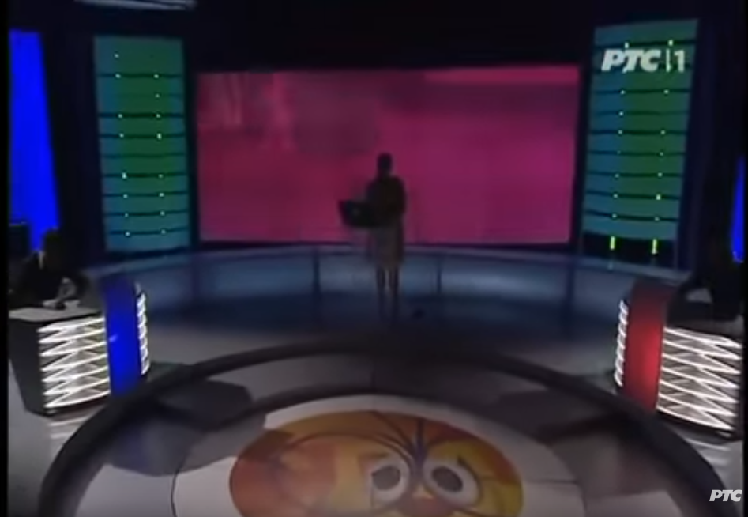
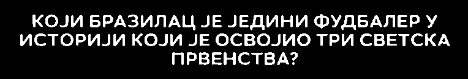
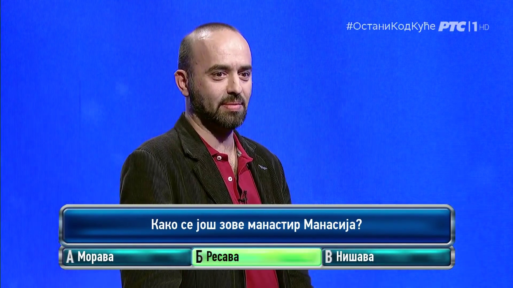
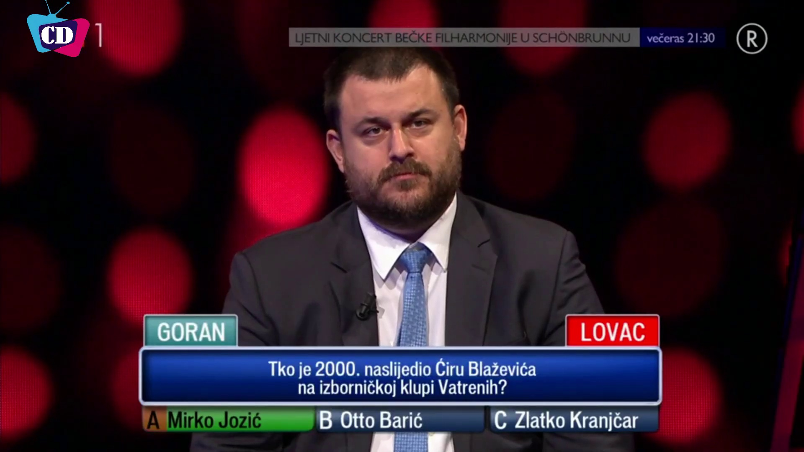
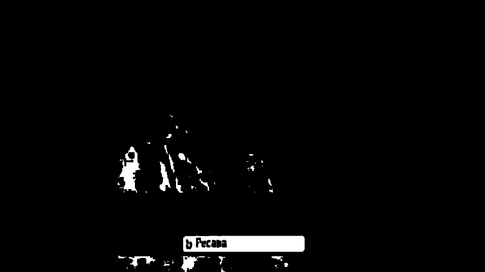
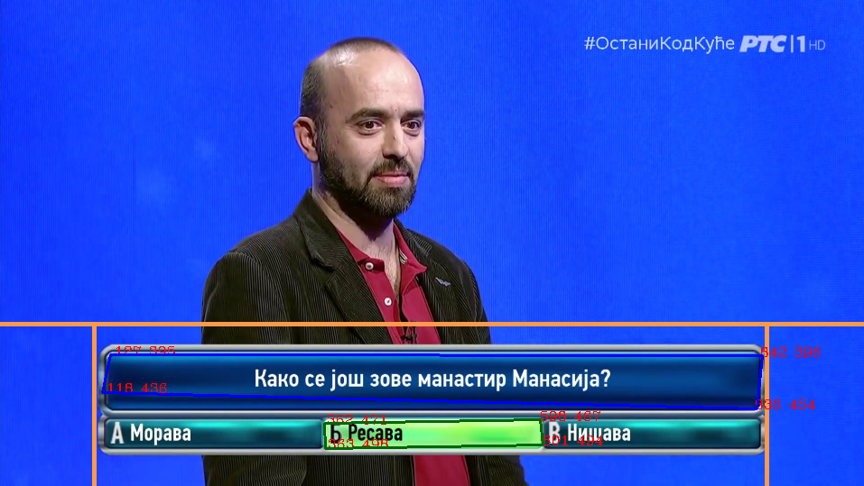
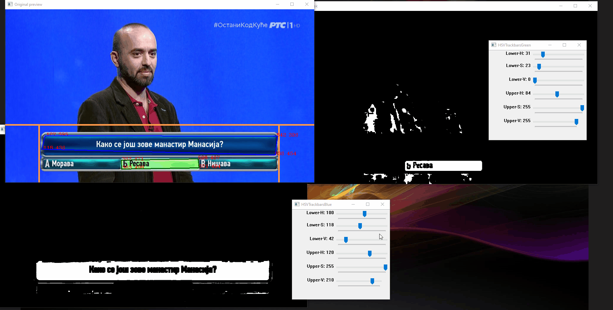

# Anansi - TV game show crawler



[Anansi](https://en.wikipedia.org/wiki/Anansi) is a computer vision (cv2 and FFmpeg) + OCR (EasyOCR and tesseract) python-based crawler for finding and extracting questions and correct answers from **video files** of popular TV game shows in the Balkan region.


Table of Contents
=================

* [Anansi - TV game show crawler](#anansi-tv-game-show-crawler)
   * [Idea & Motivation](#idea-&-motivation)
        * [Reason #1](#reason-1)
        * [Reason #2](#reason-2)
    * [Results - extracted questions & answers](#results-extracted-questions-&-answers)
        * [Slagalica questions/answers]()
        * [Pot(j)era questions answers]()
    * [Algorithm]()
        * [General idea]()
        * [Slagalica]()
            * [Slagalica pseudo algorithm]()
            * [Slagalica TV game show]()
            * [Slagalica algorithm]()
            * [Rules of the game]()
            * [Finding the beginning and the end of the game]()
                * [After 106. season]()
                * [Before 106. season]()
            * [Finding the frame with question]()
            * [OCR processing of the frames with question and answers]()
            * [Slagalica crawler example run]()
        * [Pot(j)era]()
            * [Pot(j)era pseudo algorithm]()
            * [Pot(j)era algorithm]()
            * [Rules of the game]()
            * [Finding the green box with the correct answer]()
            * [OCR processing of the frames with question and answers]()
            * [Potera crawler example run]()
    * [Optimization ideas]()
    * [Future Roadmap]()
    * [Known problems]()
    * [How to run scripts locally]()
        * [Script Requirements]()
            * [Pot(j)era requirements]()
            * [Slagalica requirements]()
            * [Pytesseract on Windows]()
        * [Main scripts]()
        * [Additional helper scripts]()
    * [Miscellaneous]()
        * [Where to find TV show episodes?]()
            * [Slagalica]()
            * [Potera]()
            * [Potjera]()

## Idea & Motivation

There are two main reasons for doing this project.

#### Reason #1
In the last couple of years, the pub quiz scene in Serbia has seen a rise in popularity. After doing a bit of research and after competing myself in some of the quizzes, I saw that a lot of questions are recycled and that it would be nice if there was some kind of a "knowledge database" where you can test yourself and perhaps prepare yourself for the quizzes. 

To my surprise, I found that there are only a couple of popular mobile/browser games that mimicks popular games from the TV shows, but are very limited when it comes to the actual distinct number of questions that they have in their databases. 

I found that a lot of questions used in the pub quizzes are from TV game shows, so, naturally, I started watching the episodes of Slagalica (Serbian), Potera (Serbian), and Potjera (Croatian), however, that took too long. Episodes of Slagalica are 22mins and Potera (eng. The Chase) is more than 40mins long. And the most fun games in both of them are games where you can directly test your knowledge - in Slagalica game is called "Ko zna zna" and in Potera, I think it does not have a name officialy, it's always being referred to as a "second game" :). 

So after giving it some thought, I decided to create a program that will go through the episodes, find the games, extract the questions, find the answers and put all of that in some spreadsheet-friendly format such as ".csv". 

After a couple of days, this is the project that I come up with. 

#### Reason #2
Learn something new. I've never, not since college anyway, done any computer vision work, and I didn't have any experience with OCRs too. So it was a really nice opportunity to venture into the unknown.

## Results - extracted questions & answers
Before we start with the algorithm explanation, requirements, and how-to-use guides, here is a full version of all the extracted questions & answers to the episodes.

### Slagalica
Note: Episodes used `2019.11.02` to `2022.07.14` todo:

### Potera
Note: Episodes used YT channels... todo

### Potjera
Note: Episodes used YT channels... todo

## Algorithm
The following is the section explaining how everything works under the hood.

### General idea
In both Slagalica and Pot(j)era, the main idea is the same:

1. Open the video file
2. Find the beginning of the desired game
3. Recognize the frame where both question and answer are visible
4. Extract sections of the frame with the texts and preprocess them for OCR
5. OCR the sections to get questions & answers
6. Move to the next question
7. Finish processing the video file if the game has ended

The easy and straightforward, almost bulletproof idea, right? What could possibly go wrong? 

## Slagalica

### Slagalica pseudo algorithm
Here is the basic idea of the Slagalica crawler algorithm. 

1. Open the video file
2. Skip the first half of the video
3. If game start is not found
    1. Go through frames until the template for the game start is found
4. If game start is found
    1. In the seek question area look for the blue mask and the blue rectangle
    2. If the question rectangle is found
        1. Monitor for changes in the answer rectangle
        2. Keep track of the changes
        3. If a change occurred in the answer rectangle
            1. Preprocess the question & answer
            2. OCR 
            3. Sanitization
5. If the number of found questions is 10 or game end is found or the video file has no more frames
    1. Finish processing

In the next sections, I will go through every step to explain the reasoning behind it and discuss the current implementation.

### Slagalica TV game show


* [https://sr.m.wikipedia.org/sr-ec/TV_slagalica](https://sr.m.wikipedia.org/sr-ec/TV_slagalica)

### Slagalica algorithm 

#### Rules of the game

In the TV game show called "Slagalica", there is a game near the end with the name "Ko zna zna", in which players are giving answers to 10 general knowledge questions. This is, I think, by far, the most liked game in the show. 

#### Finding the beginning and the end of the game

The "Ko zna zna" game begins usually in the last third of the show. So we can immediately skip the first half of the video. Then we need to figure out how to find the game start. 

##### After 106th season
Starting from the 106th season (starting from `4.5.2018`), the game intro for the "Ko zna zna" is played on the full screen just before the game. 

Game intro:


The easy thing to do was to create a template (smaller image based on the full frame) to match:


Using OpenCV you can try to find a template in the image, and the OpenCV will return the confidence level, i.e. how similar are both of the images. By using some kind of threshold (e.g. if the similarity is above `0.5`), it is trivial to find the game start with this logic.

To save the processing time, the next game (the game after "Ko zna zna") intro should also be found and be used as a game end. Sure, you can have a condition if 10 questions are found to end immediately, but sometimes, not all 10 questions will be found (sometimes TV show editor cuts to the next game before showing the last question (e.g. episode from `14.11.2018`).

Using the same logic as for the game intro, you can find the game outro (game end). And as you know, one game end is for another game the beginning - :O mindblown.gif. :) 

So, by using this reference game intro (the game after the main one):


and with the template:


You can find the next game intro, which is surely the previous game's end.

##### Before 106th season 
Before 106th season (before `4.5.2018`) the game intro was played on the big screen behind the TV show hosts. So this straightforward way of matching templates cannot work just as well as after 106th season episodes. 



TODO: Instead of template matching, use pink mask + contour matching with an area - NOT IMPLEMENTED YET

#### Finding the frame with the question
Now that we have the game start frame, we need to find the very first frame after that where the question rectangle is visible. Traditionally, the game has a rectangle-shaped area where questions and answers are shown.

The frame showing this area with question and answer:


And if we know that this area is always in the same place, and with the same dimensions/proportions, always at the bottom of the frame, we can filter out the rest of the frame, and use only this section for easier processing. We can split it to answer and questions parts. 

By creating filtered out area, we have created our "seek area", and the borders for this area are marked in the image bellow:


And if we use the percentage of the image height and width, then, the borders will be scalable and work with any resolution of the same proportions (e.g. 720p and 1080p).

Now that we have a seek area, we need to somehow find the frame with the question rectangle. Remember, up until now we have found only the game beginning, and after that, we need to check future frames when will the question appear in the rectangle. 

Usually, a TV game show host is having a little bit of pre-game monologue, so the question is not immediately presented. Also, during the game, the TV show director can cut to some random shot in the studio, losing the question frame from the screen. So, we need a reliable way to find the frame with the question rectangle.

How this rectangle looks from the start of the game (when we match the template) up until the question rectangle first frame:


If you watch closely, you can see that the seek area has a dominant blue color when the desired frame is visible. If there is some sort of dominant color, we can create a mask that will match only certain shades of blue.

Original rectangle:


if we apply the blue mask and transform it to grayscale (black and white), we get:


As you can see, all of the desired blue shade in the image is white. And the image does not have the logo in the background of the question, which helps us a lot with the thing we will try to do next.

The Blue mask image is good and all, however, what can we do with that info? Well, by looking at the blue rectangle question image, if you are familiar with the computer vision, the logical thing to do is to try to form a rectangle in this image. And we can do this by trying to find all of the contours (shapes) in this image. As you can expect, there will be a lot of shapes, however, we can approximate the shapes (make them with fewer points, and thus making them simpler). By doing this, we can get simple shapes such as squares, rectangles etc.

Example of approximation of the shapes (original image, approximation, and direct contour/shape)


Now, if we try to find contour, then do the approximation on our blue mask image, we get something like (red line closed shape):


We have something that looks like a rectangle and remember, this rectangle is based on the blue mask in the section where the question should appear. To trigger the condition that the question is visible, we need to have some kind of threshold (e.g. if the shape is taking up 70% of the image) for the area of this found shape, and if it goes above it, then the question frame is visible. The area threshold should not be hard-coded, but the percentage of the total area of pixels, to be scalable for different resolutions.

When the very first question frame has been found, the answer will not be visible.

The question area will be:


The answer area will be:


Answer text is indeed missing, but the important thing is that we now have the beginning of the game when a question is visible. The other important thing is that we know (based on game rules and analyzing the videos) that the answer area rectangle will have the following pattern:

1. empty
2. answer
3. empty
4. answer
5. empty
6. and so on...

So, now we need a way to make a distinction between a rectangle with the answer and one without it.


vs


You probably noticed that the one with the answer has a big white text. So, what can we do about it?

Well, we can create a mask again for the blue color, then invert colors, or something like that, but probably the easiest thing is to convert the image to grayscale, and then using threshold, for example, all pixels above 240 value, should remain on the image. If you get the threshold just right, you will get only the white pixels on the image. 
And if you do this on the frame without an answer, you will get an empty image (with no white pixels). 


with answer:


without answer: 


And now if we count the white pixels in images, and if we choose some kind of threshold (e.g. "400" pixels), we can compare two successive frames and figure out if there was a significant change in the frames. If change exists, that means that either answer or empty is now visible. And if we keep track of these changes, we can easily figure out when there is a question and when is an empty image (keep in mind that we need to process each question separately).

#### OCR processing of the frames with question and answers

Now for the fun part :) 

We've successfully figured out a way to find all questions and answers, but now we need to extract the questions in some kind of text document for easier processing later on. There are many different OCR solutions out there, that are using trained neural net models for recognizing the content. EasyOCR is easy to use, however, even though I used it in Pot(j)era (spoiler alert), Cyrillic letters in the font used on Slagalica are returning really bad results. So, for OCR, I am using the one that actually recognizes this font, and probably the most famous out there - `tesseract`. However, I am using a python wrapper called `pytesseract` for easier and simpler usage. 

During my experiments, I've found that tesseract works a lot better if you preprocess the images and prepare them for OCR. For example, convert them to grayscale, remove noise, apply erode (thin the objects a little bit, etc.). You can find the techniques I did before using OCR in the source code. It was a trial and error process, I guess that the preprocessing that I did will not work universally, but in these narrow and expected test cases, it worked flawlessly.

Preprocess examples:


Question:



After tesseract OCR processing, this is the string that we got:

`кОЈИ БРАЗИЛАЦ ЈЕ ЈЕДИНИ ФУДБАЛЕР  У\n\nИСТОРИЈИ КОЈИ ЈЕ ОСВОЈИО ТРИ СВЕТСКА\nПРВЕНСТВА2\n\n`

As you can see it's pretty good, but it requires sanitization. We can remove new lines (`\n`), change all letters to be uppercase, and remove double spaces (empty characters). Also, the last character, the "?" is, it seems, some other font, other than the main text, and because of it, tesseract thinks it's a number "2" :D

If we do the sanitization, we finally get:

`КОЈИ БРАЗИЛАЦ ЈЕ ЈЕДИНИ ФУДБАЛЕР У ИСТОРИЈИ КОЈИ ЈЕ ОСВОЈИО ТРИ СВЕТСКА ПРВЕНСТВА?`

To obtain the answer, the process is pretty straightforward now, but we need to keep in mind that "2" in the answer can be the actual number two. So, for the answer, we should skip "2" -> "?" sanitization.

Answer:


OCR: 

`ПЕЛЕ`

### Slagalica crawler example run

Now when you know how everything works, here is a recording of the processing of one of the episodes and the output that we received.


```
#1 Question: КОЈИМ ЛАТИНСКИМ ИМЕНОМ НА СЛОВО "С" НАЗИВАМО СРЕДСТВО ЗА СМИРЕЊЕ?

Answer: СЕДАТИВ
```

## Po(jera)

### Pot(j)era TV game show

 

* https://sr.m.wikipedia.org/sr-el/Potera)
* https://hr.wikipedia.org/wiki/Potjera_(kviz)
* https://en.wikipedia.org/wiki/The_Chase_(British_game_show)

### Pot(j)era pseudo algorithm
Here is the basic idea of the Potera and Potjera crawler algorithm. 

1. Open the video file
2. Create seek area in the bottom half of every frame
3. Up until the end of the file do:
    1. Using a green mask find the green rectangle where the answer is
    2. If a green rectangle is found:
        1. Search if the big blue rectangle above is also visible
        2. If the blue rectangle is visible:
            1. OCR the green and blue rectangles
            2. Skip 5sec (where the green rectangle is not visible anymore)
4. Finish processing of the video

In the next sections, I will go through every step to explain the reasoning behind it and discuss the current implementation.

### Pot(j)era algorithm 

#### Rules of the game

In both the Serbian and Croatian TV game shows, for every player (total of 4 players per show) there are 3 possible (if a player wins the second game, then the third game becomes available) games to play. The first and the third are done verbally and there are no visuals/graphics that show questions on the screen. However, in the second game, players are presented with a question and the possible answers. 

#### Finding the green box with the correct answer

In order to find the first question of the game, we need to find the graphics with a question and possible answers in textboxes. After the correct answer is revealed, one of the possible answers, the one which was the correct one, will become green (with green background in the textbox). 

If we look at a typical frame where the questions/answers are clearly visible, we can see that they look pretty much the same in both versions of the game show.

Potera:



Potjera:



This means that for both versions of the show, we can use the same logic.

In order to find the green box, we can use the same logic as for finding the blue box in the "Slagalica" game - create a green mask, find all the contours/shapes, approximate the shapes and find the largest one. If the area of that shape is larger than some kind of threshold, then, we have found the green textbox. 

To avoid false positives, we can then apply the same logic, but this time with the blue mask, to find, in the same frame, the large rectangle with the question. 

Consider this frame:


If we apply a green mask (the range of the green was a trial and error process) we, get something like this:



blue mask:


and here are contours/shapes found in the green/blue masks. Please notice the orange seek area limits - by using these limits, we can discard all the points (red x,y coordinates) of the shapes that do not belong inside



If both the green rectangle and the big blue one are visible in the same frame, and they are both located in the seek area (where we expect the question/answer to appear), then we can continue with the text extraction/OCR.

But before the OCRing section, here is a recording of the simple tool that I created for finding good HSV values for the blue and green masks.



#### OCR processing of the frames with question and answers

Creating images from the frame is now pretty straightforward. 

In "Slagalica" tesseract was used, but here we tried something else - EasyOCR. This is one of the few open source solutions for OCR that is not based on tesseract. So, naturally, I wanted to try it.

For tesseract, manual preprocessing of the images is needed, however, EasyOCR does all of this automatically, which is pretty cool. 


Original frame:


Question:


EasyOCR: `Како се још зове манастир Манасија?`

Answer:


EasyOCR: `Б Ресава`


We can also try tesseract, instead of EasyOCR, but honestly, there is no need. EasyOCR has proven to be really good for Potera OCR.

### Potera crawler example run


```
Question: Како се још зове манастир Манасија?
Answer: Б Ресава
```

## Optimization ideas
* In Slagalica if not all 10 questions are found, maybe rollback to the start of the game and then process it again but this time with lower fps 
* 

## Future Roadmap

* Handle 480p Slagalica 2014-2018 period
* Do something with the data?
* Slagalica algo can be modified to obtain texts from other games as well (Asocijacije, Spojnice, Slagalica)

## Known problems
* If there are both Latin and Cyrillic text in the questions/answers, sometimes tesseract can return really bad results (EasyOCR is, it seems, better at this)
* In some episodes of Slagalica answer is not shown to the audience, instead, it immediately cuts to the intro of the next game (e.g. `14.11.2018.` episode)
* On really rare occasions in Slagalica, question text can be seen above the question rectangle box (e.g. `18.06.2020.` episode)


## How to run scripts locally

### Script Requirements

To be able to run the scripts, first, you are going to need some dependencies installed that are not coming pre-installed with python by default.

#### Pot(j)era requirements

* Python 3.x
* OpenCV - cv2
* EasyOCR
* FFmpeg
* Potera or Potjera full episodes video files

#### Slagalica requirements

* Python 3.x 
* OpenCV - cv2
* EasyOCR
* Pytesseract
* FFmpeg
* Slagalica full episodes video files

#### Pytesseract on Windows
Just follow this guide:

https://stackoverflow.com/a/53672281

## Main scripts

1. `slagalica-batch-video.py` 

Slagalica batch processing (all video files are in the same directory) 
```
python slagalica-batch-video.py -srcdir "path" -o "path"
```
for example

```
python slagalica-batch-video.py -srcdir "E:\Slagalica\Slagalica-1080p-sve\batch3" -o "E:\Slagalica\Slagalica-1080p-sve\batch3\results" -csv "batch3-questions.csv" -d True -showt False
```

Arguments:
```
"-srcdir", "--source", help="directory with video files", default="./examples/testVideoBatch")
"-o", "--output", help="directory for csv and debug data output", default="results")
"-lang", "--language", help="ocr language, can be either rs_latin or rs_cyrillic", default="rs_cyrillic")
"-csv", "--csvFileName", help="name for csv file", default="questions.csv")
"-d", "--debugData", help="create frame image files for every image processed. note: can use up a lot of data space!", default="True")
"-showt", "--showtime", help="create windows and preview of everything that is happening", default="False"
```

2. `potera-batch-video.py` 

Potera batch processing (all video files are in the same directory) 

```
`python potera-batch-video.py -srcdir "path"  -o "path"`
```
For example:
```
`python potera-batch-video.py -srcdir "E:\Potera\uradjeno-3"  -o "results" -lang "rs_cyrillic" -csv "questions.csv" -d True`
```

Arguments:
```
"-srcdir", "--source", help="directory with video files", default="./examples/testVideoBatch"
"-o", "--output", help="directory for csv and debug data output", default="results"
"-lang", "--language", help="ocr language, can be either rs_latin or rs_cyrillic", default="rs_cyrillic"
"-csv", "--csvFileName", help="name for csv file", default="questions.csv"
"-d", "--debugData", help="create frame image files for every image processed. note: can use up a lot of data space!", default="True"
```

#### Additional helper scripts
1. `potera-single-image.py` tool used to easily process a single frame, instead of the whole video. Mainly used for debugging and during development.
2. `potera-single-video.py` script where actual processing of video file is done. The batch script is calling this script for every file in the directory.
3. `slagalica-single-image.py` tool used to easily process a single frame, instead of the whole video. Mainly used for debugging and during development.
4. `slagalica-single-video.py` script where actual processing of video file is done. The batch script is calling this script for every file in the directory.
5. `slagalica-z-image-diff-test.py` debugging tool used to find differences between two images
6. `slagalica-z-threshold-finder.py` debugging tool for finding correct values for global thresholding
7. `slagalica-z-file-renamer.py` small script designed for renaming batch of files with custom template matching - needed because Slagalica episodes were not alphabetically sorted due to the Serbian DateTime culture (i.e. 21.06.2020 -> 2020.06.21)


# Miscellaneous

## Where to find TV show episodes?

### Slagalica
All the episodes can be found on the official channel of ["RTS Slagalica - Zvanični kanal"](https://www.youtube.com/c/RTSSlagalicazvani%C4%8Dnikanal]). However, there is no easy way to download all of the episodes. Youtube playlists on the channel are also often incomplete. So, I've manually gone through all episodes and created [JDownloader2](https://jdownloader.org/jdownloader2) dlc files that can you easily download to your PC.

[15.05.2014 - 03.05.2018 (480p and old intros) total: 1259 episodes](./resources/jdownloader-dlcs/Slagalica-480p-720p-stari-intro-stara-grafika.dlc)

[04.05.2018 - 03.11.2018 (480p & 720p mixed, new intros but old graphics in the studio) total: 192 episodes](./resources/jdownloader-dlcs/Slagalica-720p-novi-intro-stara-grafika.dlc)

[4.05.2018 - 02.11.2019 (720p new intros new graphics new studio) total: 363 episodes](./resources/jdownloader-dlcs/Slagalica-720p-novi-intro-nova-grafika.dlc)

[03.11.2019 - now (1080p) total: 978 episodes](./resources/jdownloader-dlcs/Slagalica-1080p-sve.dlc)

DLCs last updated: 14.07.2022.

### Potera
There is no official site or youtube channel. You can find a lot of episodes on Youtube, but they are regularly being removed. Here are some channels that currently have some episodes uploaded:

[Potera-yt-Damjan-Petrovic.dlc total: 42 episodes](./resources/jdownloader-dlcs/Potera-yt-Damjan-Petrovic.dlc)

[Potera-yt-pfc-zauvek.dlc total: 4 episodes](./resources/jdownloader-dlcs/Potera-yt-pfc-zauvek.dlc)

DLCs last updated: 14.07.2022.

### Potjera
There is no official site or youtube channel. You can find a lot of episodes on Youtube, but they are regularly being removed. Here are some channels that currently have some episodes uploaded:

[Potjera-Dionysius-Dominus-Trabem-Pannonius-april-maj-jun-2019.dlc total: 32 episodes](./resources/jdownloader-dlcs/Potjera-Dionysius-Dominus-Trabem-Pannonius-april-maj-jun-2019.dlc)

[Potjera-EnigmaTV-decembar-2020.dlc total: 21 episodes](./resources/jdownloader-dlcs/Potjera-EnigmaTV-decembar-2020.dlc)

[Potjera-Hrvatska.dlc total: 54 episodes](./resources/jdownloader-dlcs/Potjera-Hrvatska.dlc)

[Potjera-Tomislav-Vrban.dlc total: 63 episodes](./resources/jdownloader-dlcs/Potjera-Tomislav-Vrban.dlc)

DLCs last updated: 14.07.2022.