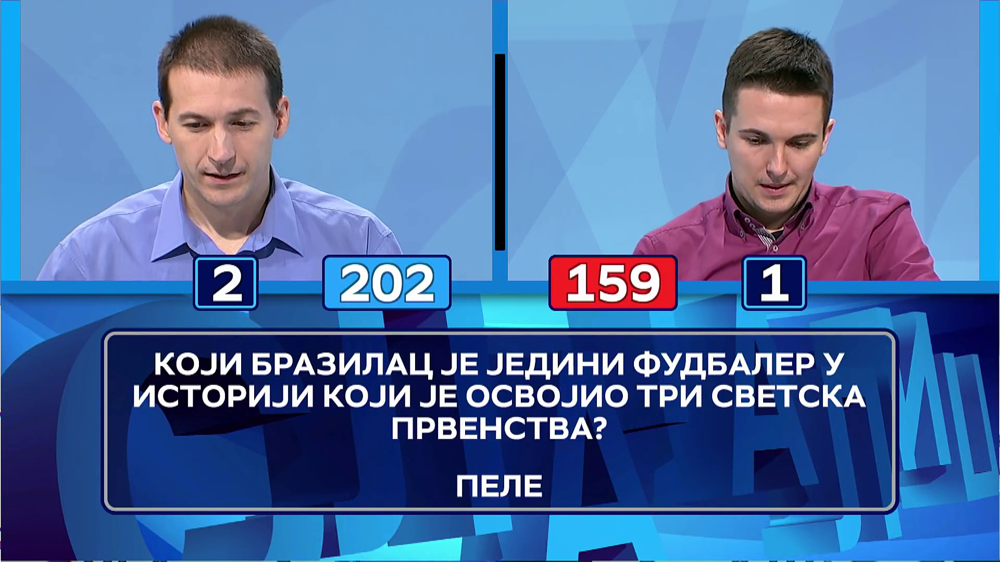
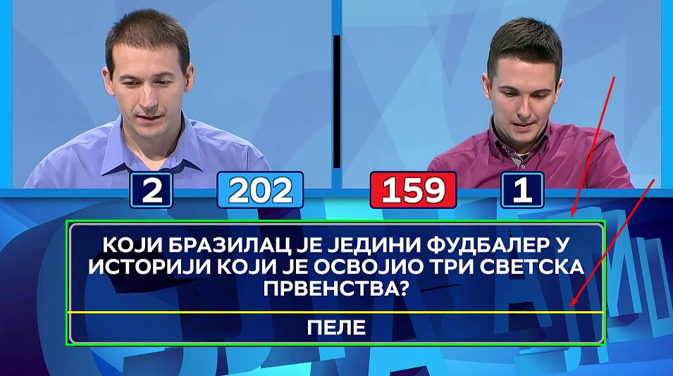
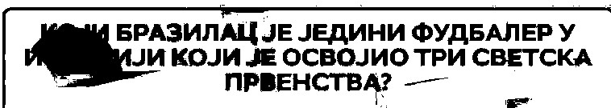
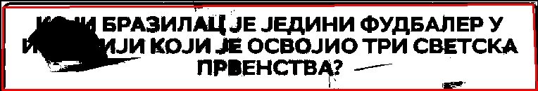

# pabkvizgenerator - TBD

Computer vision (cv2 and ffmpeg) + OCR (EasyOCR and tesseract) python based project for finding and extracting questions and correct answers from **video files** of popular TV game shows in the Balkan region.

## Idea & Motivation

There are two main reasons for doing this project.

#### Reason #1
In the last couple of years, pub quiz scene in Serbia has seen a rise in popularity. After doing a bit of research and after being a part of the scene myself, I saw that a lot of questions are recycled and that it would be nice if there was some kind of a "knowledge database" where you can test yourself and perhaps prepare yourself for the quizes. 

On my surprise I found that there are only a couple of popular mobile/browser games that mimicks popular games from the TV shows, but are very limited when it comes to the actual distinct number of the questions that they have in their databases. 

I found that a lot of questions used in the pub quizes are from the TV game shows, so, naturally I started watching the episodes of Slagalica (Serbian), Potera (Serbian) and Potjera (Croatian), however that took too long. Episodes of Slagalica are 22mins and Potera (eng. The Chase) are more than 40mins long. And the most fun games in both of them are games where you can directly test your knowledge - in Slagalica game is called "Ko zna zna" and in Potera, I think it's called "the second game :D". 

So after giving it some thought, I decided to create a program that will go through the episodes, find the games, extract the questions, find the answers and put all of that in some spreadsheet friendly format such as ".csv". 

After couple of days, this is the project that I come up with. 

Enjoy and use/distribute freely.

#### Reason #2
Learn something new. I've never (not since college) done any computer vision, and I didn't have any experience with OCRs. So it was a nice opportunity to venture into the unknown.

## Results - extracted questions & answers
Before we start with the algorhitm explanation, requirements and how to use guides, here is a full version of all the extracted questions & answers of the game shows.

### Slagalica questions/answers
Note: Episodes used `2019.11.02` to `2022.07.14` todo:

### Pot(j)era questions answers
Note: Episodes used yt channels... todo

## Algorithm
The following is the section explaining how everything works under the hood.

### General idea
In both Slagalica and Pot(j)era, the main idea is the same:

1. Open video file
2. Find beginning of the desired game
3. Recognize the frame where both question and answer are visible
4. Extract sections of the frame with the texts and preprocess them for OCR
5. OCR the sections to get question & answers
6. Finish processing of the video file if the game has ended
7. Move to the next question

### Slagalica algorithm

In the TV game show called "Slagalica" there is a game near the end with the name "Ko zna zna" in which players are giving answers to 10 general knowledge questions. This is, I think, by far, the most liked game in the show. 

#### Finding the beginning and the end of the game

The "Ko zna zna" game begins usually in the last third of the show. So we can immedaitely skip the first half of the video. Then we need to figure out how to find the game start. 

##### After 106. season
Starting from the 106. season (starting from `4.5.2018`), the game intro for the "Ko zna zna" is played at full screen just before the game. 

Game intro:

Easy thing to do was to create a template to match:

Using OpenCV you can try to find a template in the image, and the OpenCV will return confidency level, i.e. how similar are both of the images. By using some kind of threshold (e.g. if similarity is above `0.5`), it is trivial to find the game start with this logic.

If you don't wanna process the video until the end, game end is also needed. Sure, you can have a condition if 10 questions are found to end immediately, but sometimes, not all 10 questions will be found (sometimes TV show editor cuts to the next game before showing last question e.g. episode from `14.11.2018.`).

Using the same logic as for game intro, you can find the game outro (game end). And one game end is for another game the beginning mindblown.gif. :) So, by using this reference Game intro (the game after the main one):

and with template:

You can find the next game intro, which is surely the last game end.

##### Before 106. season 
Before 106. season (before `4.5.2018`) the game intro was played behind the TV show hosts. So this straighforward way of matching templates cannot work just as good. TODO: Instead use contour matching with area - NOT IMPLEMENTED YET

#### Finding the frame with question
Now that we have game start frame, we need to find the very first frame after that where question rectangle is visible. Traditionally, the game has a rectangle shaped area where questions and answers are shown.

The frame showing this area with question and answer:

And if we know that area is the same proportions at the bottom of the frame, we can extract this section for easier processing. We can split it to answer and question. These are the seek borders:

And if we use percentage of the image height and width, then, the borders will be scalable and work with any resolution of the same proportions (e.g. 720p and 1080p).

Now that we have a seek area, we need to somehow find the frame with question rectangle. Remember, we up until now have found only the game beginning, and after that we need to check future frames when will the question appear in the rectangle. Usually TV game show host is having a little bit of pre game monologue, so the question is not immeadetely presented. Also, during the game, the TV show director can cut to some random shot in the studio, losing the question frame from the screen. So, we need a reliable way to find the frame with the question rectangle.

How this rectangle looks from the start of the game (when we match the template) up until the question rectangle first frame:

If you watch closely, you can see that the seek area has a dominant blue color when the desired frame is visible. If there is some sort of dominant color, we can create a mask that will match only certain shades of blue.

Original rectangle:

if we apply blue mask and transform it to grayscale (black and white), we get:

As you can see, all of the desired blue shade in the image is white. And the image does not have logo in the background of the question, which helps us a lot with the thing we will try to do next.

Blue mask image is good and all, however, what can we do with that info? Well, we are looking the blue rectangle question image, the logical thing to do is to try to form rectangle in this image. And we can do this by trying to find all of the contours (shapes) in this image. As you can expect, there will be a lot of shapes, however, we can aproximate the shapes and make them with less shapes.

Example of aproximation of the shapes (original image, aproximation, and direct contour/shape)

Now, if we try to find contour, then do the aproximation on our blue mask image, we get something like (red line closed shape):

We have something that looks like a rectangle, and remember, this rectangle is based on blue mask in the section where question should appear. In order to trigger the condition that question is visible, we need to have some kind of threshold (e.g. if shape is taking up the 70% of the image) for the area of this found shape, and if it goes above it, then the question frame is visible. The area threshold should not be hard-coded, but the percentage of the total area of pixels, in order to be scalable for different resolutions.

#### Finding the frame with question
When the very first question frame has been found, the answer will not be visible.

Question area will be:

Answer area will be:

Answer text is indeed missing, but the important thing is that we now have the beginning of the game when question is visible. The other important thing is that we know (based on game rules and analyzing the videos) that answer area rectangle will have the following pattern:

1. empty
2. answer
3. empty
4. answer
5. empty
6. and so on...

So, now we need a way to make distinction between rectangle with answer and one without it.

vs

You probalby noticed that the one with the answer has a big white text. So, what can we do about it?

Well, we can create a mask again for blue color, then invert colors, or someting like that, but probably the easiest thing is to convert the image to grayscale, and then using threashold, for example all pixels above 240 value, should remain on the image. If you get the threashold just right, you will get only the white pixels on the image. 
And if you do this on the frame without answer, you will get an empty image (with no white pixels). 

with answer:

without answer: 

And now if we count the white pixels in images, and if we choose some kind of threashold (e.g. 400 for number of pixels), we can compare two successive frames and figure out if there was a significant change in the frames. If change exists, that means that either answer or empty is now visible. And if we keep track of these changes, we can easily figure out when there is a question and when is an empty image (we need to process each question separately)

#### OCR the frames with question and answers

Now for the fun part :) 

We've successfuly figured out a way to find all questions and answers, but now we need to extract the questions in some kind of text document for easier processing later on. There are many different OCR solutions out there, that are using trained neural net models for recognizing the content. EasyOCR is really easy to use, however, even though I used it in Pot(j)era (spoiler alert), cyrillic letters in the font used on Slagalica is returning really bad results. So, for OCR, I am using the one that actually recognizes this font, and probably the most famous out there - `tesseract`. However, I am using python wrapper called `pytesseract` for easier and simpler usage. 

During my experiments, I've found that tesseract works a lot better if you preprocess the images and prepare them for OCR. For example, convert them to grayscale, remove noise, apply erode (thin the objects a little bit etc.). You can find the techniques I did before using OCR in the source code. It was really a trial and error process, I guess that my preproccesing that I did will not work universally, but in these really narrow and expected test cases, it worked flawlessly.

Tesseract OCR:

### Slagalica Example run

## How to run
If you want to run this project locally, you will to install couple of dependencies first and obtain video files of the TV game shows for processing. 

### Where to find TV show episodes?
#### Slagalica
Here are packages linked for all slagalica

#### Potera

#### Potjera

### Script Requirements

To be able to run the scripts, first you are going to need some dependencies installed that are not coming pre-installed with python installer by default.

#### Pot(j)era requirements

* Python 3.x
* OpenCV - cv2
* EasyOCR
    * EasyOCR models
* ffmpeg
* Potera or Potjera full episodes video files

#### Slagalica requirements

* Python 3.x 
* OpenCV - cv2
* EasyOCR
* Pytesseract
* ffmpeg
* Slagalica full episodes video files

#### Run scripts

Simply run

`python potera-batch-video.py -srcdir "E:\Potera\uradjeno-3"  -o "results" -lang "rs_cyrillic" -csv "questions.csv" -d True`

`python slagalica-batch-video.py -srcdir "E:\Slagalica\Slagalica 109 ciklus full"  -o "results" -csv "questions.csv" -d True`

primer da nekad se ne prikaze odgovor
Slagalica 14.11.2018. (720p_25fps_H264-192kbit_AAC)

extract resources for potera (template) ako ima tako nesto za poteru bese?

https://github.com/UB-Mannheim/tesseract

https://github.com/UB-Mannheim/tesseract/wiki
pip install Pillow

#### Additional helper scripts
Explain the scripts

dodaj linkove za sve slagalice po rezolucijama

colin mecree... ne radi za eng trenutno dobro kada mesa slova batch2 ima primer

## Optimization ideas

## Roadmap

## Known problems
tesseract multiple language potential problem?

## Pytesseract on Windows
Just follow this guide:

https://stackoverflow.com/a/53672281
